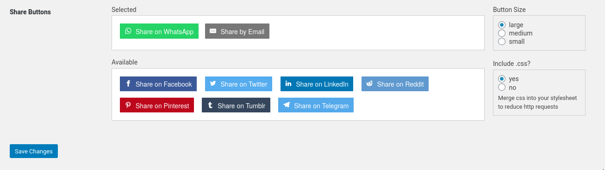
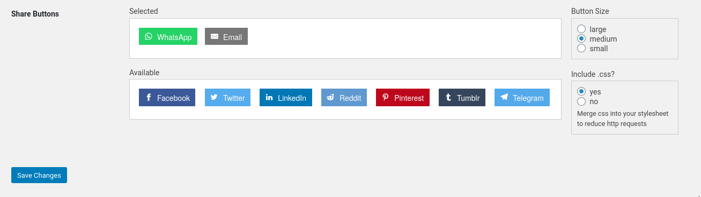
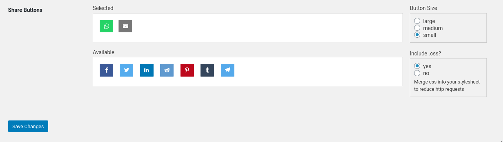
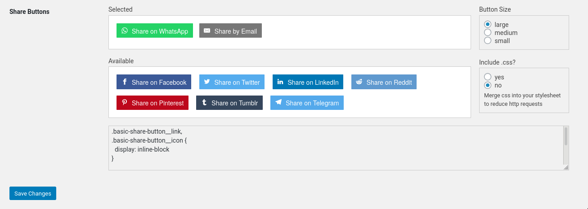
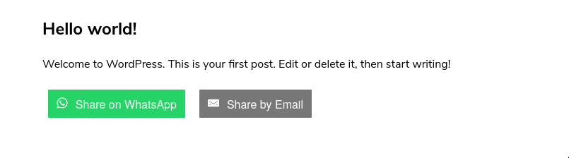

# Basic Social Share Buttons
Contributors: basicbydesign  
Tags: social shares, social buttons, share buttons, social share buttons  
Requires at least: 5  
Tested up to: 5.7.1  
Stable tag: 5  
Requires PHP: 7.0  
License: MIT  
License URI: https://opensource.org/licenses/MIT  

Basic Social Share Buttons. Easily stylable. Fast loading. No Javascript. No tracking.  

## Description

Basic Social Share Buttons allows your users to share posts to social networks without loading any javascript.  

## Configuration

Admin options are in the Wordpress admin under Reading.  

You can choose between three button sizes:  
* Small - Icon only  
* Medium - Icon + site name  
* Large - Icon + "Share on " + site name  

You can choose to include the css (via wp_enqueue) or you can disable the enqueue and the css rules will be shown in admin for you to insert in your main stylesheet (for one less http request).  

## Usage 

Use the short `[basic-share-buttons]` in your post content.  

or in a php template its `<?php echo do_shortcode('[basic-share-buttons]'); ?>`  

The title and URL are taken from Wordpress's `the_title()` and `the_permalink()` functions.  

You can override both as parameters to the shortcode.
`[basic-share-buttons title='Your custom page title' url='http://customurl.com/page']`  

## Screenshots 

## Changelog

### 1.0 
* Initial launch
